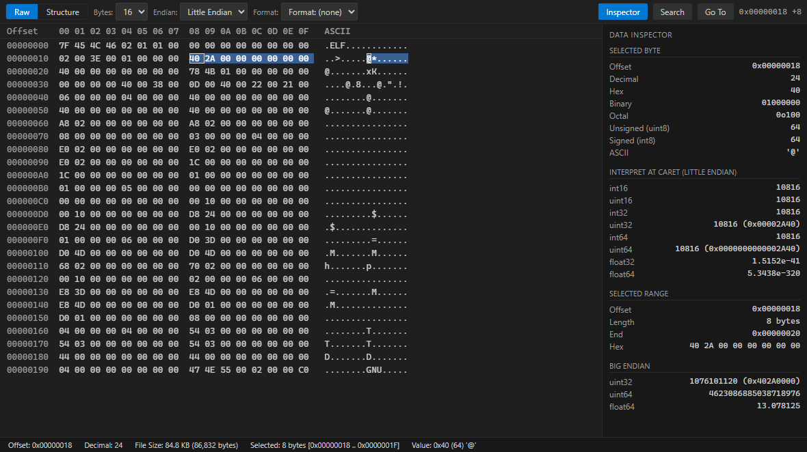
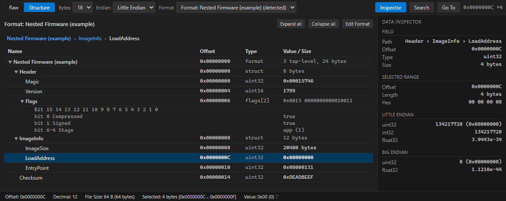

# Binary Viewer & Structure Inspector

Inspect binary files in VS Code: a fast, virtualized **hex viewer** (UltraEdit-style
layout) plus a **user-defined structure decoder** for firmware images, EEPROM /
flash dumps, device-config blobs, packet captures, memory dumps and other
proprietary binary formats.

Built on the VS Code **Custom Editor API** (not a text editor), so it opens
multi-hundred-MB and multi-GB files without loading them into memory.

## Raw hex view

Classic `Offset · Hex · ASCII` layout. Select bytes in either column and the
other follows; the data inspector interprets the selection as every integer and
float type, little- **and** big-endian.



## Structure view

Point a **binary format definition** at the file and read it as a tree of named
fields. Structures nest arbitrarily, child offsets are relative to their parent
(resolved to absolute for you), and selecting a field highlights exactly its
bytes back in the hex view.



## What you get

- **16 / 8 / 32 bytes per row**, virtualized rendering, horizontal + vertical
  scroll, full keyboard navigation, hex ⟷ ASCII selection sync.
- **Data inspector** — per-byte hex/binary/octal/signed/unsigned/ASCII and
  `int8…int64` / `uint8…uint64` / `float32` / `float64` for the selection in both
  endiannesses.
- **Structure decoding** from declarative JSON: scalars, strings
  (`ascii`/`utf8`/`utf16`), `enum`, bit-fields (with a `Bit 7…0` grid), `array`,
  **nested `struct`**, `timestamp`, per-field endianness, scale/bias/unit.
- **Nested structures** — a field with a `fields` array and no `type` is a
  container; unlimited depth, mixes freely with flat fields, collapse/expand
  remembered per session, `Format › Header › Field` breadcrumb.
- **Automatic format detection** by file extension and magic bytes; switch or
  clear the format at any time without reopening the file.
- **Binary search** — hex (`FF 00 A5 10`, `??` wildcards), text (optional
  case-insensitive), UTF-8, UTF-16, bit patterns (`10101010`); find
  next / previous / all, streamed so huge files don't block.
- **Go To Offset** — `0x1000`, `4096`, or `1000h`.
- **Format editor** — build and nest structures visually (`+ Add Field` /
  `+ Add Structure`, move in/out, reorder), with live validation. Import / export
  definitions as JSON.
- Native VS Code look — theme variables throughout, so light, dark and
  high-contrast all work.

Read-only by design in this version.

## Getting started

1. Right-click a binary file in the Explorer → **Open With…** → **Binary Viewer**
   (or run **Binary Viewer: Open With Binary Viewer**). It registers as an
   *optional* editor for `.bin .hex .img .dat .fw .rom .dump .raw .eeprom .nvram`
   and never takes over a file type on its own.
2. It opens in **Raw** mode immediately — no setup needed.
3. Toggle the **Structure** tab (or <kbd>Ctrl/Cmd+Alt+S</kbd>) once a format is
   applied. If a format matches the file's extension or magic bytes it is
   selected automatically; otherwise pick one from the **Format** dropdown or run
   **Binary Viewer: Create Binary Format**.
4. Click a structure field to highlight its bytes; toggle the inspector with
   <kbd>Ctrl/Cmd+Alt+I</kbd>.

### Custom formats

Formats are plain JSON — there is no expression language and nothing in a
definition is executed. They load with precedence **workspace → global →
builtin**, so a repository can ship its proprietary layouts in
`.vscode/binary-viewer/formats/*.json` and have them override the globals
(workspace formats load only in trusted workspaces). See
[FORMAT_DEFINITIONS.md](docs/FORMAT_DEFINITIONS.md) for the full schema.

```jsonc
{
  "name": "Example Firmware",
  "fileExtensions": [".fw"],
  "endianness": "little",
  "fields": [
    {
      "name": "Header",
      "offset": 0,
      "fields": [
        { "name": "Magic",   "type": "uint32", "offset": 0, "display": "hex" },
        { "name": "Version", "type": "uint16", "offset": 4 }
      ]
    },
    { "name": "Checksum", "type": "uint32", "offset": 20, "display": "hex" }
  ]
}
```

## Commands

| Command | Shortcut |
| --- | --- |
| Binary Viewer: Go To Offset | <kbd>Ctrl/Cmd+G</kbd> |
| Binary Viewer: Search | <kbd>Ctrl/Cmd+F</kbd> |
| Binary Viewer: Find Next / Previous | <kbd>F3</kbd> / <kbd>Shift+F3</kbd> |
| Binary Viewer: Toggle Structure View | <kbd>Ctrl/Cmd+Alt+S</kbd> |
| Binary Viewer: Toggle Inspector | <kbd>Ctrl/Cmd+Alt+I</kbd> |
| Binary Viewer: Show Field in Raw View | — |
| Binary Viewer: Select Binary Format | — |
| Binary Viewer: Create / Edit / Duplicate / Delete Binary Format | — |
| Binary Viewer: Import / Export / Reload Binary Formats | — |

## Settings

| Setting | Default | Description |
| --- | --- | --- |
| `binaryViewer.bytesPerRow` | `16` | Bytes per row in the raw view (8/16/32) |
| `binaryViewer.defaultEndianness` | `little` | Inspector / format default |
| `binaryViewer.showInspectorByDefault` | `true` | Show the inspector on open |
| `binaryViewer.blockSizeBytes` | `65536` | Range-read / cache granularity |
| `binaryViewer.cacheWindowBytes` | `8388608` | Max host-side cache per file |
| `binaryViewer.autoDetectFormat` | `true` | Detect a format on open |
| `binaryViewer.maxSearchResults` | `5000` | Cap for *Find All* |

## Documentation

- [User guide](docs/USER_GUIDE.md)
- [Format-definition reference](docs/FORMAT_DEFINITIONS.md)
- [Architecture](docs/ARCHITECTURE.md)
- [Contributing / building from source](CONTRIBUTING.md)
- [`examples/`](examples/) — sample format definitions and matching binaries

## Author

Devontae Reid — [www.devontaereid.com](https://www.devontaereid.com) ·
[github.com/y0dev/binary-viewer-extension](https://github.com/y0dev/binary-viewer-extension)

## License

MIT — see [LICENSE](LICENSE).
